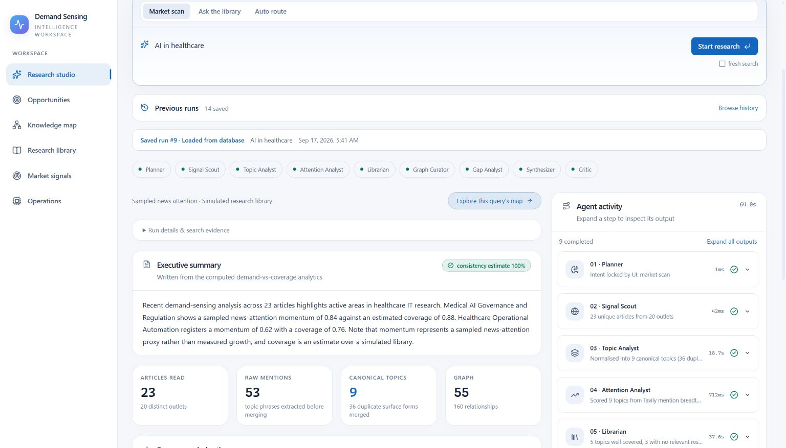
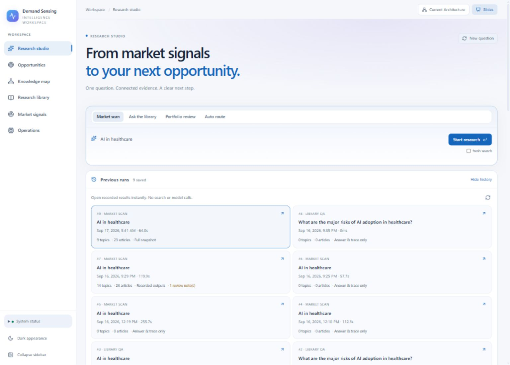
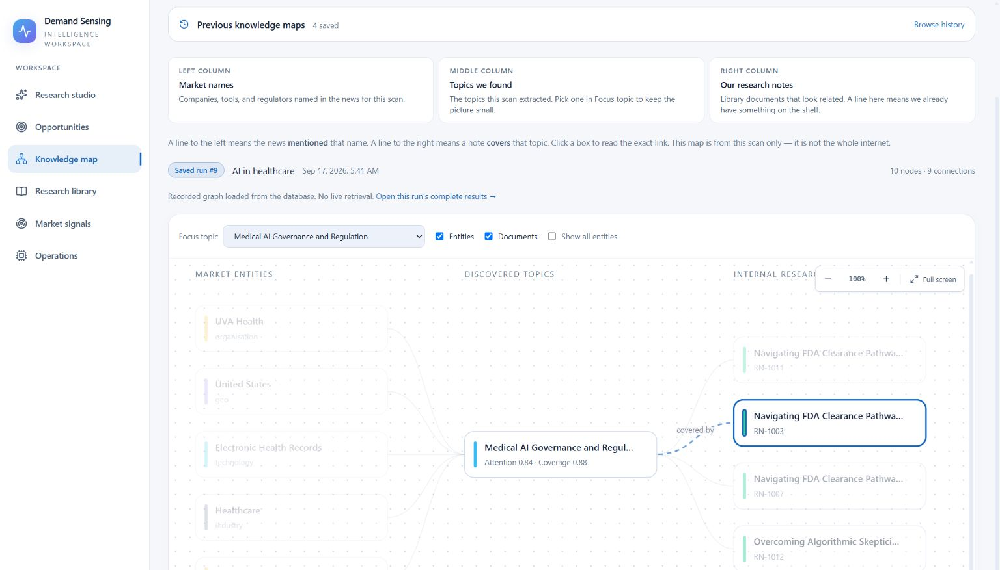
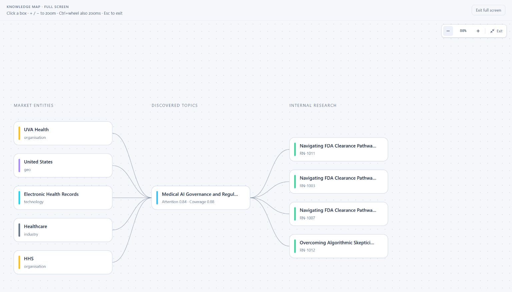
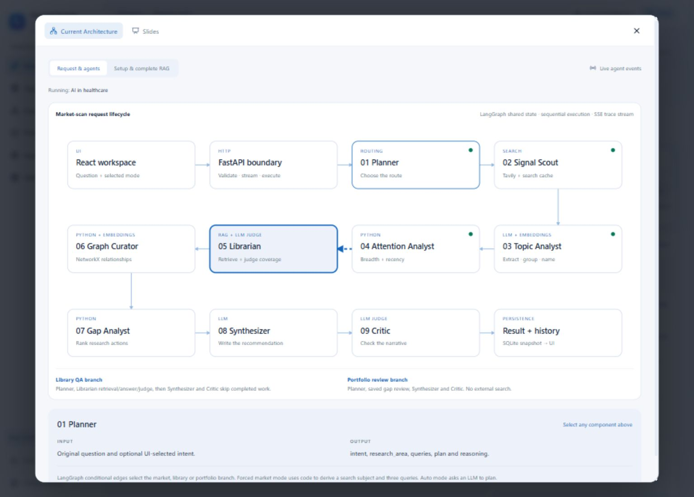
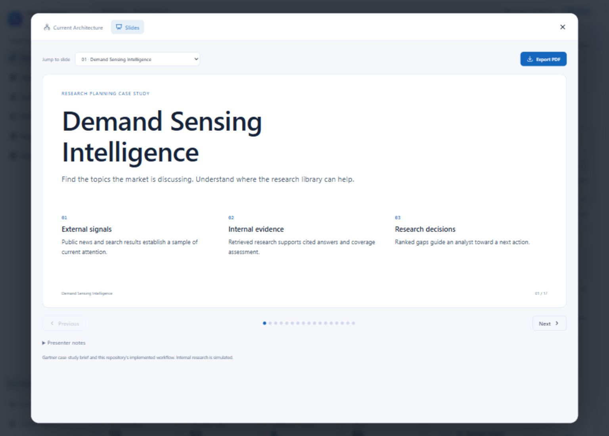

# Demand Sensing Intelligence

Local demo for a Gartner-style research-planning case study.

The prototype answers two jobs:

1. **Market scan** — public news in, canonical topics, coverage of a **simulated** research library, ranked research actions out.
2. **Ask the library** — a client question in, a cited answer from that library out.

You should **not** generate documents or rebuild embeddings. The seeded SQLite library, FAISS index, and saved demo runs are in the repository. A clone only installs Python packages and Node packages, then starts the two servers. There is no FAISS build step and no “add documents” step.

A printable copy of this guide is **[README.pdf](README.pdf)** (for email). This Markdown file is the source of truth in Git.

| Layer | URL |
|---|---|
| Frontend (use this in the browser) | http://127.0.0.1:5173 |
| Backend API | http://127.0.0.1:8000 |

API keys (`backend/.env`) are **not** in Git. They are sent separately by email.

---

## Product tour

These screenshots are in `screenshot/` so a clone shows the workspace before anyone starts the servers.

### Research studio

Saved **Market scan** for `AI in healthcare` (run #9 from the committed database). Nine specialists complete in order. The executive summary, article counts, and agent activity stay with the run.



### Previous runs

Open a recorded result instantly. No news search and no model calls. Use this first if you want the feel of the product without waiting for a live scan.



### Knowledge map

Entities named in the news (left), canonical topic (centre), accepted internal notes (right). A line to the left is a **mentions** link. A line to the right is **covered by**. The map is scoped to that scan, not the whole internet.



Fullscreen view of the same map:



### Current Architecture

Top-right **Current Architecture** opens a live-wired map of the LangGraph workflow. Click a node for inputs and outputs.



### Slides

Top-right **Slides** opens the executive deck (26 pages: 20 main + 6 appendix). Download PowerPoint or PDF from that viewer. The files also live in `presentation/`.



---

## What you need on the machine

- **Python 3.11+** (developed on 3.13). Check: `python --version`
- **Node.js 20+** (includes npm). Check: `node --version` and `npm --version`
- The **`.env` file from email**, saved as `backend/.env`

Windows, macOS, and Linux all work. Commands below show PowerShell. On macOS/Linux use `backend/venv/bin/python` instead of `backend\venv\Scripts\python.exe`.

---

## 1. Get the code

```powershell
git clone https://github.com/yashugupta786/Agentic-Research-Intelligence-Platform.git
cd Agentic-Research-Intelligence-Platform
```

The repository is **public**. Anyone with the link can clone it or download the ZIP from GitHub without signing in. API keys are still not in the repo.

Or unzip the archive and open that folder.

Confirm these files exist **before** installing anything:

```
backend/data/intelligence.db
backend/data/library.faiss
backend/data/library_ids.json
backend/.env.example
```

If the `.db` or `.faiss` file is missing, stop and ask for a complete checkout. Do **not** run the seed script to “fix” a missing index unless you were told to. Seeding spends Gemini quota and can take a long time.

---

## 2. Add API keys (from email)

1. Copy `backend/.env.example` to `backend/.env`
2. Paste the two keys from the email:

```
GOOGLE_API_KEY=...
TAVILY_API_KEY=...
```

3. Save. There should be **no quotes** around the keys and **no** `backend/.env` in Git.

The app reads **only** `backend/.env`. A `.env` in the repo root is ignored.

Keys are required only for a **new** live scan or a **new** library answer. If Gemini or Tavily is unavailable at their end, they can still browse the library and open **Previous runs**. Those screens load from SQLite only. They do not call Gemini, Tavily, or rebuild FAISS.

The committed database already includes complete snapshots from this machine, including:

| Run | Mode | Question | What they see |
|---|---|---|---|
| **#9** | Market scan | `AI in healthcare` | 23 articles, 9 topics, 55-node graph (~64 s) |
| **#10** | Market scan | `AI in supply chain` | 23 articles, 14 topics, 87-node graph |
| **#11** | Market scan | `AI in healthcare` | 23 articles, 10 topics, 63-node graph |
| **#12** | Ask the library | `What are the risks of AI in healthcare` | Cited answer |
| **#13** | Portfolio review | same question | Saved gap review |

Older rows in Previous runs (ids 1–8) are leftover traces without a full snapshot. Use **#9** (or #10 / #11) for the product feel.

---

## 3. Backend (one-time)

From the **project root**:

```powershell
cd backend
python -m venv venv
.\venv\Scripts\python.exe -m pip install --upgrade pip
.\venv\Scripts\python.exe -m pip install -r requirements.txt
```

macOS / Linux:

```bash
cd backend
python3 -m venv venv
./venv/bin/python -m pip install --upgrade pip
./venv/bin/python -m pip install -r requirements.txt
```

### Start the API

**Option A — from `backend/` (recommended)**

```powershell
.\venv\Scripts\python.exe run.py
```

**Option B — from the project root** (uses `backend/venv` if it exists)

```powershell
python run.py
```

Leave this terminal open. You should see:

```
Uvicorn running on http://127.0.0.1:8000
Ready | index=435 vectors | llm=True | web_search=True
```

`index=` should be about **435**. That number comes from the committed FAISS file, not from a setup job. `llm=True` and `web_search=True` mean the `.env` keys were picked up. If they are `False`, Previous runs and library browse still work; only *new* questions will fail.

Quick check: [http://127.0.0.1:8000/api/health](http://127.0.0.1:8000/api/health)

---

## 4. Frontend (one-time, second terminal)

Keep the backend running. Open a **new** terminal at the project root:

```powershell
cd frontend
npm install
npm run dev
```

Open **[http://127.0.0.1:5173](http://127.0.0.1:5173)** — that is the app.

Vite proxies `/api` to port 8000. Always use the **5173** URL in the browser, not 8000, or live agent updates will not work.

---

## 5. First ten minutes

1. Land on **Research studio**.
2. Open **Previous runs** and load **run #9** (`AI in healthcare`). This is a full saved scan: topics, coverage, agent trace, and knowledge map. **Gemini is not used.**
3. If keys work, optionally mode **Ask the library** with `What are the major risks of AI adoption in healthcare?`. If Gemini does not work, open saved **run #12** instead.
4. Optional **new** Market scan with `AI in healthcare`. That path needs Gemini and Tavily. Skip it if those services fail.

Do not close the tab until a *new* live run finishes if you want that extra result saved. The runs listed above are already in the database you cloned.

### Safe demo questions

- Market scan: `AI in healthcare`
- Market scan: `AI in supply chain`
- Ask the library: `What are the major risks of AI adoption in healthcare?`

---

## Workspace map

| Place | What it is |
|---|---|
| **Research studio** | Ask a question. Market scan, Ask the library, or Auto route. Previous runs. |
| **Opportunities** | Saved demand-vs-coverage portfolio (not a second teaching chart of the current scan). |
| **Knowledge map** | Query-scoped graph: entities, topics, accepted notes. |
| **Research library** | Browse notes and ask RAG questions. |
| **Market signals** | Stored Tavily articles from scans. |
| **Operations** | Topology and run mechanics. |
| **Current Architecture** | Overlay: LangGraph blueprint. Click a node for detail. |
| **Slides** | Overlay: executive PowerPoint renders, plus PPTX/PDF download. |

---

## Everyday start (after install)

Terminal 1 — from the project root:

```powershell
python run.py
```

(or `cd backend` then `.\venv\Scripts\python.exe run.py`)

Terminal 2:

```powershell
cd frontend
npm run dev
```

Browser: [http://127.0.0.1:5173](http://127.0.0.1:5173)

---

## What not to do

| Don’t | Why |
|---|---|
| Commit or paste `.env` into Git | Keys |
| Run `python -m scripts.seed` | Rebuilds the library; uses quota; not needed |
| Open the UI on port 8000 | SSE proxy is on 5173 |
| Use `uvicorn --reload` | Can kill a long scan |
| Treat attention as proven client demand or surge | Attention is from the current news sample, not a historical baseline |

---

## Troubleshooting

**`llm=False` or `web_search=False` at startup**  
`backend/.env` is missing, in the wrong folder, or the variable names are wrong. Restart `run.py` after saving `.env`.

**`index=0` or “library files are missing”**  
`intelligence.db`, `library.faiss`, and `library_ids.json` must sit together in `backend/data/`. Re-clone / re-copy the repo; do not seed unless asked.

**Port 8000 already in use**  
Stop the other process, or change the port in `backend/run.py` **and** `frontend/vite.config.ts` (`proxy.target`) to match.

**Port 5173 already in use**  
Vite will pick 5174. Use the URL it prints. Backend CORS allows 5173 by default; stay on 5173 if you can.

**Frontend loads, every `/api` call fails**  
Backend is not running, or it is not on `127.0.0.1:8000`.

**`npm install` fails**  
Use Node 20+. Delete `frontend/node_modules` and run `npm install` again. A lockfile is included (`package-lock.json`).

**`pip install faiss-cpu` fails**  
You need a 64-bit CPython 3.11–3.13. 32-bit Windows Python will not work.

**Scan sits still, then errors**  
Usually Gemini or Tavily quota (HTTP 429). Library browse and **Previous runs** still work without a new scan. Retry after a few minutes.

**Windows: `python` not found**  
Try `py -3.13` or `py -3`. Create the venv with that launcher: `py -3 -m venv venv`.

---

## Optional checks

From `backend/` with the venv active:

```powershell
.\venv\Scripts\python.exe -m unittest discover -s tests -v
```

These tests mock providers and do not need live keys.

---

## Project layout

```
backend/                      FastAPI, agents, SQLite, FAISS
  run.py                      Start the API
  .env                        Keys (email only — not in Git)
  data/intelligence.db        Simulated library + saved runs
  data/library.faiss          Chunk index
  data/library_ids.json       Vector → document/chunk map
frontend/                    React UI
presentation/                Executive PPTX, PDF, slide renders
screenshot/                  Product screenshots used in this README
scripts/                     Rebuild the executive deck if needed
run.py                       Same API start from the repo root
README.pdf                   Printable copy of this guide
```

The in-app **Slides** overlay and `presentation/` contain the executive deck (PowerPoint, PDF and speaker notes). That is the explanation sent by email.

---

## Boundaries (please read)

The research notes are **simulated**. Live market scans rank **sampled news attention**, not client demand and not a validated surge. Coverage thresholds are prototype heuristics. This is a local MVP: no production login, and one scan at a time is the intended use.
